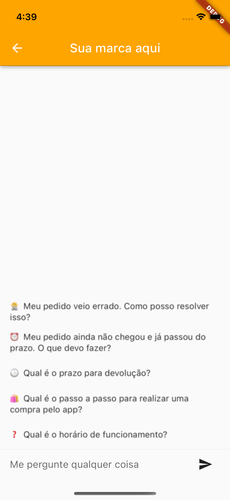
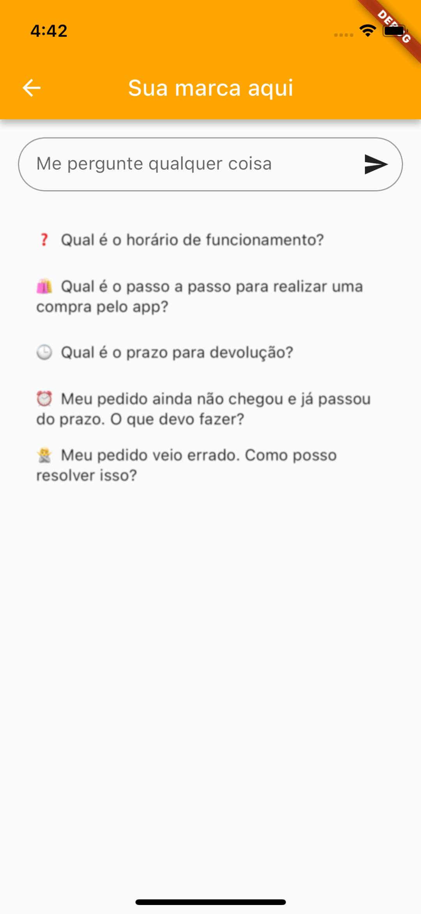

# Integração do Megamil Answer Bot no Seu Aplicativo iOS

* !!! ATENÇÃO !!! por motivos de segurança, é possível testar apenas em um aparelho físico. Testar no simulador ou em um ambiente de testes, homologação, etc. resultará em uma tela preta.

## Ambiente

* Altere seu Podfile e adicione a seguinte linha
```Bash
pod 'MegamilAnswerBot'
```
* Em seguida instale usando o comando
```Bash
pod install
```


## Adicionar ao código

* Nosso projeto está em flutter, só é possível usar chamando pelo sistema de MethodChannel

Primeiro importe o flutter na tela que irá chamar o chat.
```
import Flutter
```

Instancie a classe, de preferência na inicialização da tela, exemplo:
```
var flutterEngine: FlutterEngine?
var flutterMethodChannel: FlutterMethodChannel?
...
//Não alterar o name megamil_answer_bot nem o br.com.megamil/callSDK
flutterEngine = FlutterEngine(name: "megamil_answer_bot")
flutterEngine!.run(withEntrypoint: nil, initialRoute: "/")
flutterMethodChannel = FlutterMethodChannel(name: "br.com.megamil/callSDK", binaryMessenger: flutterEngine!.binaryMessenger) 
```

Caso deseje monitorar a conversa, manter uma cópia ou simplesmente debugar você pode acessar em tempo real assim:
```
flutterMethodChannel?.setMethodCallHandler { (call, result) in
    if call.method == "updateModel" {
        if let jsonResult = call.arguments as? String {
            if let jsonData = jsonResult.data(using: .utf8) {
                do {
                    print("#### Atualização dos dados ####")
                    let messagesModel = try JSONDecoder().decode(SDKModel.self, from: jsonData)
                    print(messagesModel.showData())
                    print("#### --- ####")
                } catch {
                    print("Erro ao fazer parse do JSON: \(error.localizedDescription)")
                }
            }
        }
    }
}
```

## Objeto de criação

* Para chamar a tela, é possível enviar um objeto para customizar muitas coisas, inclusive abrir a conversa com o histórico de mensagens, sugestões para perguntas exibidas antes da primeira pergunta e outros.

* Antes copie nossa classe, não é necessário alterar nada nela, O único campo obrigatório é o token, copie nosso arquivo aqui: [SDKModel.swift](https://raw.githubusercontent.com/Megamil/megamil_sdk_answer_sample/main/megamil_sdk_answer_sample/SDKModel.swift)

```
/// - parameter token: Token para uso do SDK [Obrigatório]
/// - parameter title: Título que é exibido na tela
/// - parameter aiName: Nome para IA, aparece no inicio da resposta. [Minha IA] Resposta...
/// - parameter primaryColor: Hexadecimal para cor primária
/// - parameter secondaryColor: Hexadecimal para cor secundária
/// - parameter placeholderInput: Texto temporário que aparece no campo de digitação
/// - parameter showAppBar: Exibir navigation?
/// - parameter listSuggestions: Lista de String com sugestões para tópicos ou perguntas.
/// - parameter listMessages: Histórico de mensagens, com Hora do envio, mensagem e flag para saber quem enviou a mensagem.
let jsonObject: SDKModel = SDKModel(
    token: "TOKEN_QUE_ENVIAMOS", //unico obrigatório, qualquer valor errado será considerado como chamada para testes
    title: "",
    aiName: "",
    primaryColor: "",
    secondaryColor: "",
    placeholderInput: "",
    showAppBar: true,
    listSuggestions: [],
    listMessages: []
)
```

* Após configurar é só chamar a tela passando os parâmetros, seja por push ou present, como modal ou tela cheia, etc.
Use o método invokeMethod para abrir a tela do chat. Passe 'emptyChat' para abrir uma tela com sugestões, ou 'directChat' para abrir diretamente o chat.
```
let jsonString = jsonObject.encode()
flutterMethodChannel!.invokeMethod("emptyChat", arguments: jsonString)
self.present(flutterViewController, animated: true)
```

Veja dois exemplos completos na ViewController.swift para entender como integrar o Megamil Answer Bot em diferentes contextos

## Resultado
<div style="overflow: hidden; white-space: nowrap;">
    
    
    
</div>
